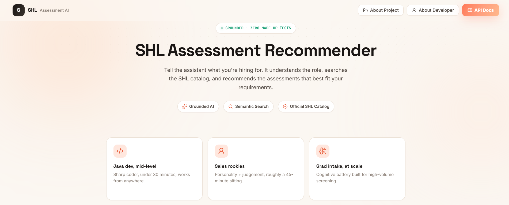
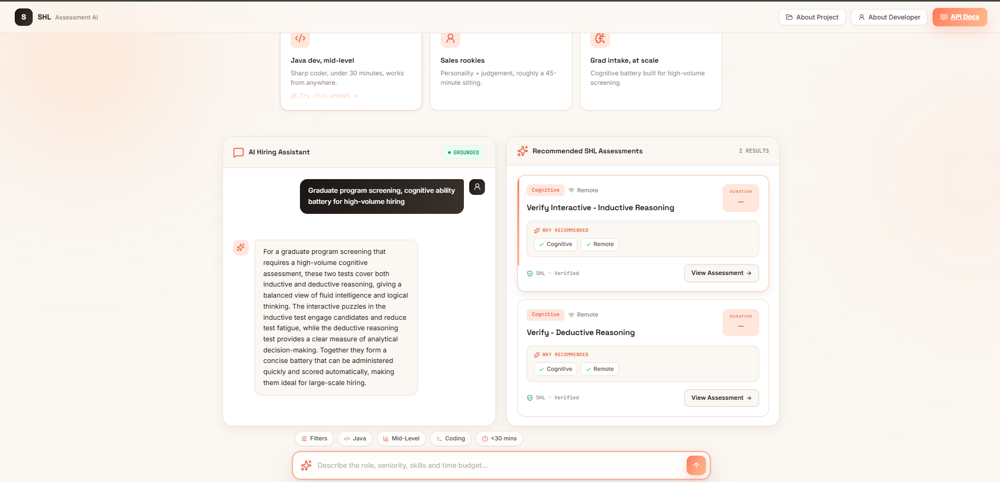
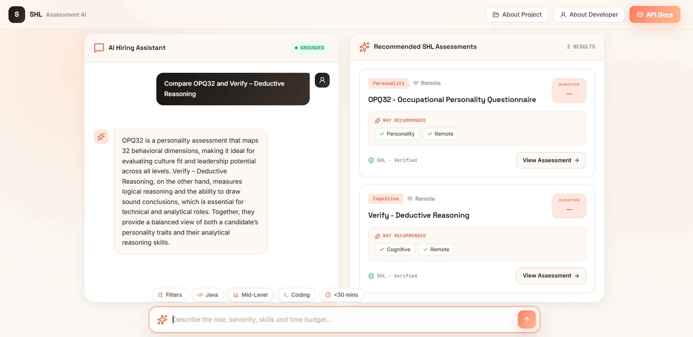
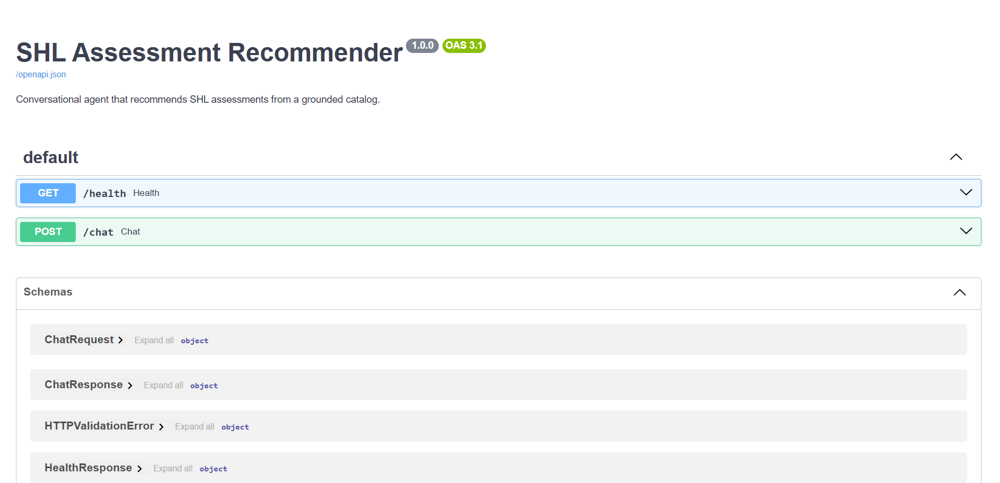
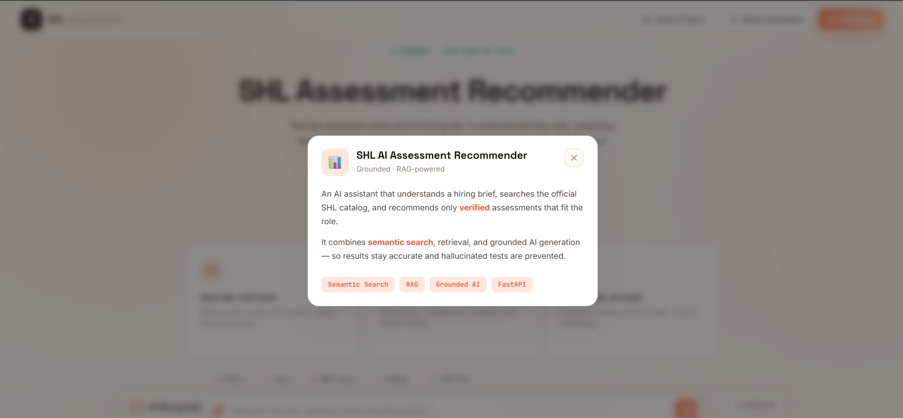
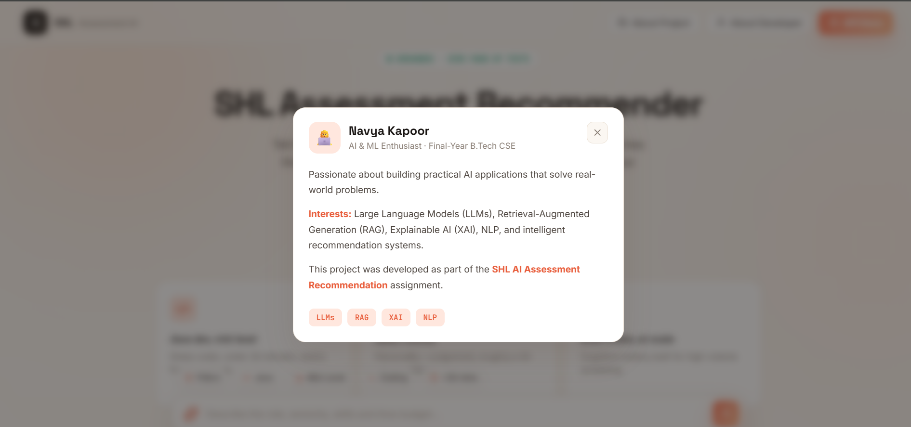

<<<<<<< HEAD
# 🚀 SHL Assessment Recommender

<p align="center">

AI-powered conversational assistant for recommending SHL assessments using <b>Retrieval-Augmented Generation (RAG)</b>, <b>Groq Llama 3.1</b>, <b>FAISS Semantic Search</b>, and <b>FastAPI</b>.

</p>

<p align="center">


</p>

---

# 📸 Application

<p align="center">



</p>

---

# 📌 Overview

The SHL Assessment Recommender is an AI-powered hiring assistant that helps recruiters discover the most suitable SHL assessments through natural language conversations.

Instead of manually searching the SHL catalog, users simply describe the hiring requirement (role, skills, seniority, duration, or assessment objective). The assistant understands the intent, retrieves relevant assessments using semantic search, and generates grounded recommendations.

The project was developed as part of the **SHL AI Assessment Recommendation Assignment**.

---

# ✨ Features

- 🤖 Conversational Hiring Assistant
- 🧠 Groq Llama 3.1 powered reasoning
- 🔍 Hybrid Retrieval (Semantic + Keyword Search)
- 📚 Retrieval-Augmented Generation (RAG)
- ⚡ FastAPI REST API
- 🛡️ Grounded Recommendations
- ❌ Zero Hallucinated Assessment URLs
- 🔄 Multi-turn Conversation Refinement
- ⚖️ Assessment Comparison
- 📄 OpenAPI Documentation
- 🧪 Automated Testing

---

# 🏗️ System Architecture

<p align="center">


</p>

---

## Workflow

```text
User Query
      │
      ▼
Router LLM (Groq)

      │
 ┌────┼────────────────────┐
 │    │                    │
 ▼    ▼                    ▼
Clarify      Compare      Recommend / Refine

                          │
                          ▼
                 Metadata Filtering

                          │
                          ▼
              Hybrid Retrieval (FAISS)

                          │
                          ▼
                  Grounding Validation

                          │
                          ▼
                     Writer LLM

                          │
                          ▼

             Final Grounded Recommendation
```

---

# 🛡️ Grounding Strategy

The system prevents hallucinations by using a strict retrieval pipeline.

- Only assessments present in the SHL catalog are indexed.
- Metadata filtering is performed before retrieval.
- Hybrid retrieval combines semantic similarity with keyword matching.
- The Writer LLM only receives validated catalog entries.
- Recommendation objects are generated directly from validated catalog data.
- URLs are never generated by the language model.

This guarantees that every recommendation returned by the API exists inside the SHL catalog.

---

# 🧠 Technology Stack

| Component | Technology |
|------------|------------|
| Backend | FastAPI |
| LLM | Groq Llama 3.1 |
| Retrieval | FAISS |
| Embeddings | Sentence Transformers |
| Prompt Routing | Groq |
| Parsing | BeautifulSoup |
| Validation | Pydantic |
| Testing | PyTest |
| Deployment | Docker |

---

# 📂 Project Structure

```text
shl-recommender/

│
├── app/
│   ├── main.py
│   ├── schemas.py
│   ├── services/
│   │      ├── llm.py
│   │      ├── retrieval.py
│   │      └── orchestrator.py
│   └── static/
│
├── data/
│
├── scripts/
│
├── tests/
│
├── Dockerfile
├── requirements.txt
└── README.md
```

---

# 📸 Screenshots

## Landing Page


---

## Recommendation Flow



---

## Assessment Comparison



---

## API Documentation



---

## About Project



---

## About Developer



---

# ⚙️ Installation

Clone the repository

```bash
git clone https://github.com/navyakapoor004/shl-assessment-recommender.git
```

Move into the project

```bash
cd shl-assessment-recommender
```

Create virtual environment

```bash
python -m venv venv
```

Activate environment

Windows

```bash
venv\Scripts\activate
```

Linux / Mac

```bash
source venv/bin/activate
```

Install dependencies

```bash
pip install -r requirements.txt
```

---

# 🔑 Environment Variables

Create a `.env` file

```env
GROQ_API_KEY=your_api_key
```

---

# ▶️ Run the Application

```bash
uvicorn app.main:app --reload
```

Application

```
http://127.0.0.1:8000
```

Swagger Documentation

```
http://127.0.0.1:8000/docs
```

Health Check

```
GET /health
```

---

# 📬 API Endpoints

## GET /health

Returns

```json
{
  "status": "ok"
}
```

---

## POST /chat

Example Request

```json
{
  "messages": [
    {
      "role": "user",
      "content": "I need a Java developer assessment under 30 minutes."
    }
  ]
}
```

Example Response

```json
{
  "reply": "Here are the best assessments for your hiring requirement.",
  "recommendations": [
    {
      "name": "SHL Coding (Java)",
      "url": "https://...",
      "test_type": "Coding"
    }
  ],
  "end_of_conversation": false
}
```

---

# 🧪 Running Tests

```bash
pytest
```

The test suite validates

- API endpoints
- Recommendation pipeline
- Retrieval quality
- Comparison workflow
- Grounding validation
- Response schema

---

# 🚀 Deployment

The application can be deployed on

- Render
- Docker
- Hugging Face Spaces
- Railway

Health Endpoint

```
GET /health
```

Chat Endpoint

```
POST /chat
```

---

# 🔮 Future Improvements

- Conversation memory
- Redis caching
- Analytics dashboard
- Multi-language support
- Authentication
- Assessment feedback learning

---

# 👩‍💻 About the Project


---

# 👩‍💻 About the Developer


---

# 👤 Author

**Navya Kapoor**

AI & Machine Learning Enthusiast

Built as part of the **SHL AI Assessment Recommendation Assignment**.

If you found this project interesting, feel free to ⭐ the repository.
=======
---
title: Shl Assessment Recommender
emoji: 📚
colorFrom: purple
colorTo: yellow
sdk: docker
pinned: false
---

Check out the configuration reference at https://huggingface.co/docs/hub/spaces-config-reference
>>>>>>> 7ca36b3bfcd2dd35fa8e11518a4c0fd428764ef7
